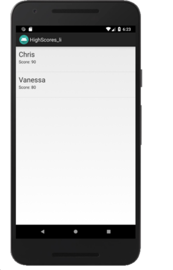

# High Scores

An android app that records user names and scores, displays them in descending order, and saves the data on a local text file.

## Features

* File I/O
* AsyncTask
* Parcelable
* RecyclerView
* Comparable

## Preview

 

## Authors

[@aytona](https://github.com/aytona) - Christopher

[@vli034](https://github.com/vli034) - Vanessa

## License

This project is licensed under the MIT License - see [LICENSE](docs/LICENSE) for details.
